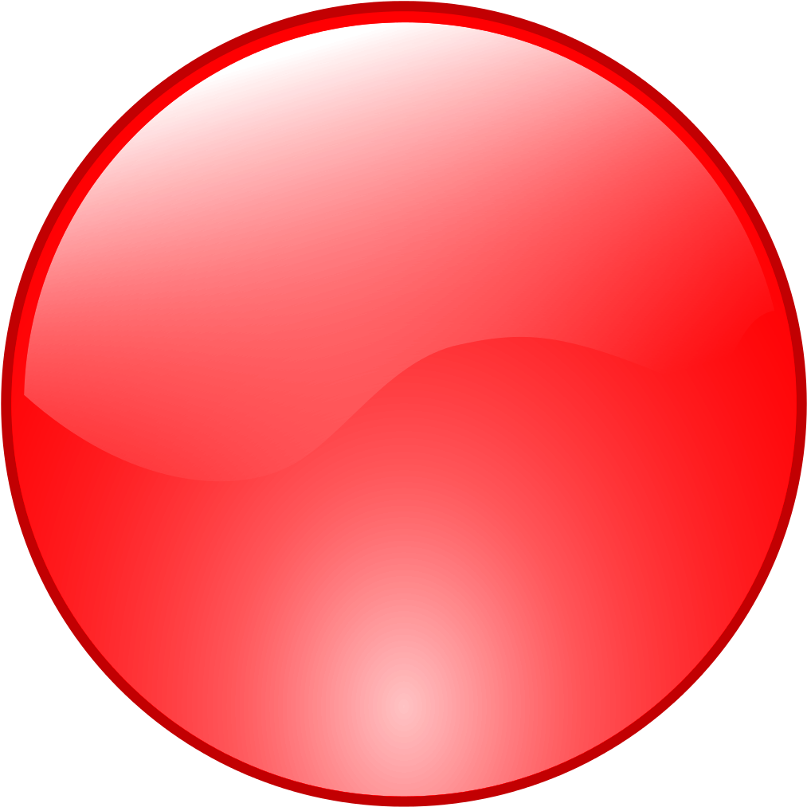

# Hello, I'm Sahal Alzubair

- Fullstack web developer
- Software Engineer at Waared  

  
 

### Feel free to reach out and say hi :D

# Care for a game?
This is an open connect4 game ANYONE can play. This project is inspired by [this template](https://github.com/marcizhu/readme-chess).  
It uses github actions to trigger the script when a new issue opens, which in turn updates the board and closes the issue.  
for more details, check [this repository](https://github.com/mastagoon/connect4-readme).  

It's Mastagoon's turn! He is playing as 

To play, click on any of the numbers at the bottom of the board.

| | | | | | | |
|:---:|:---:|:---:|:---:|:---:|:---:|:---:|
|  |  |  |  |  |  |  |
|  |  |  |  |  |  |  |
|  |  |  |  |  |  |  |
|  |  |  |  |  |  |  |
|  |  |  |  |  |  |  |
|  |  |  |  |  |  |  |
 | [1](https://github.com/Mastagoon/mastagoon/issues/new?body=move+1&title=Connect4:+move:+1) | [2](https://github.com/Mastagoon/mastagoon/issues/new?body=move+2&title=Connect4:+move:+2) | [3](https://github.com/Mastagoon/mastagoon/issues/new?body=move+3&title=Connect4:+move:+3) | [4](https://github.com/Mastagoon/mastagoon/issues/new?body=move+4&title=Connect4:+move:+4) | [5](https://github.com/Mastagoon/mastagoon/issues/new?body=move+5&title=Connect4:+move:+5) | [6](https://github.com/Mastagoon/mastagoon/issues/new?body=move+6&title=Connect4:+move:+6) | [7](https://github.com/Mastagoon/mastagoon/issues/new?body=move+7&title=Connect4:+move:+7) |

 

Last 5 plays:

| Color | Player | Column | Message |
| --- | --- | --- | --- |
|  | [abubakreosama](https://github.com/abubakreosama) | 6 | move 6 |
|  | [Mastagoon](https://github.com/Mastagoon) | 3 | move 3 |
|  | [laglag1994](https://github.com/laglag1994) | 5 | move 5 |
|  | [Mastagoon](https://github.com/Mastagoon) | 2 | move 2 |
|  | [mohammed5420](https://github.com/mohammed5420) | 3 | move 3 |

 

  
  

